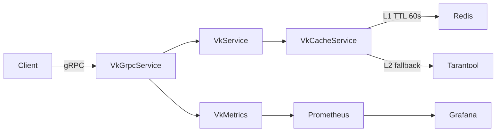
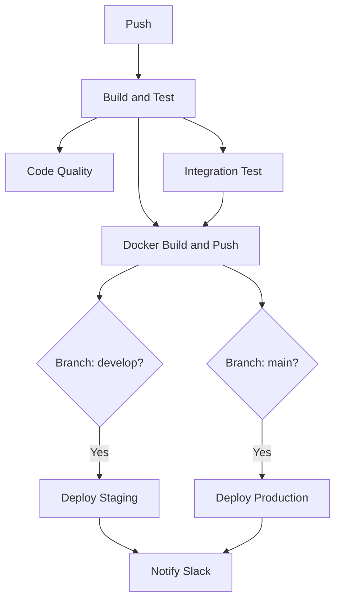

# VK Project

gRPC key-value сервис на Java 21 + Tarantool 3.2 + Redis кэш.

## Архитектура



## Быстрый старт

```bash
git clone https://github.com/Maru3022/VK.git
cd VK
docker-compose up --build
docker-compose -f docker-compose.monitoring.yml up -d
```

- **gRPC API**: `localhost:9090`
- **Actuator/Health**: `localhost:8080/actuator/health`
- **Grafana**: `localhost:3000` (admin/admin)
- **Prometheus**: `localhost:9091`

## API Reference (grpcurl)

### Put (вставка)
```bash
grpcurl -plaintext -d '{"key":"hello","value":"d29ybGQ="}' localhost:9090 vk.VkService/Put
```

### Put null (вставка пустого значения)
```bash
grpcurl -plaintext -d '{"key":"nullkey"}' localhost:9090 vk.VkService/Put
```

### Get (получение)
```bash
grpcurl -plaintext -d '{"key":"hello"}' localhost:9090 vk.VkService/Get
```

### Delete (удаление)
```bash
grpcurl -plaintext -d '{"key":"hello"}' localhost:9090 vk.VkService/Delete
```

### Range (диапазон)
```bash
grpcurl -plaintext -d '{"key_since":"a","key_to":"z","page_size":100}' localhost:9090 vk.VkService/Range
```

### Count (количество)
```bash
grpcurl -plaintext localhost:9090 vk.VkService/Count
```

## Стратегия кэширования

L1: Redis (TTL 60s) → L2: Tarantool

- **Get**: Redis → промах → Tarantool → запись в Redis.
- **Put/Delete**: Tarantool → инвалидация Redis.
- **Range/Count**: всегда Tarantool, без кэширования.
- **Null value**: sentinel `byte[]{0x00}` в Redis и специальный wrapper `VkValue` в Java отличают закэшированный null от отсутствия ключа.
- **Redis fallback**: автоматическое переключение на Tarantool при недоступности Redis.

## Обработка Null значений

В gRPC (proto3) поля по умолчанию не могут быть `null`. Для поддержки `null` используется `google.protobuf.BytesValue`.

1. **Вставка**: если поле `value` в `PutRequest` отсутствует, в Tarantool записывается `nil`.
2. **Хранение**: Tarantool поддерживает `is_nullable = true` для поля `value`.
3. **Кэширование**: в Redis записывается `0x00` (sentinel), если значение в БД — `nil`.
4. **Получение**: `VkValue` объект в коде содержит флаг `exists` и массив `data`. Если `exists=true` и `data=null`, это означает, что ключ существует, но его значение пустое.

## Производительность

- **Range**: использование итератора `GE` с батчами по 500 записей (без полной загрузки в память).
- **Count**: выполнение `box.space.VK:len()` на стороне Tarantool за O(1).
- **Пул соединений**: min 2 / max 10 соединений к Tarantool.
- Оптимизировано для работы с 5 000 000+ записей.

## CI/CD Pipeline



## Kubernetes (Helm)

```bash
helm upgrade --install vk-service ./helm/vk-service \
  --set image.tag=latest \
  --namespace vk --create-namespace
```

**HPA**: min 2 / max 10 реплик, CPU target 70%.

## Технические решения

| Решение | Обоснование |
|---|---|
| **BytesValue** | Позволяет передавать `null` в gRPC (proto3). |
| **GE Cursor** | Оптимально для больших диапазонов (5М+ записей). |
| **Redis Sentinel** | Предотвращает "cache stampede" для null-значений. |
| **Fallback** | Приоритет доступности над консистентностью кэша. |
| **Separate Monitoring** | Вынос мониторинга в отдельный compose для гибкости. |
