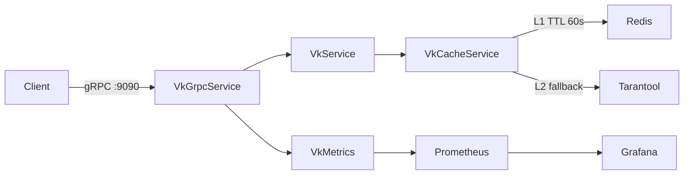
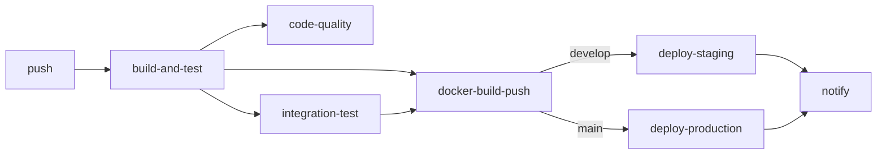

# vk-service

gRPC key-value сервис на Java 21 + Tarantool 3.2 + Redis кэш.

## Architecture

## Quick Start

git clone <repo>
cd vk-service
docker-compose up --build
docker-compose -f docker-compose.monitoring.yml up -d

gRPC:      localhost:9090
Actuator:  localhost:8080/actuator/health
Grafana:   localhost:3000  (admin/admin)
Prometheus: localhost:9091

## API Reference (grpcurl)

# put
grpcurl -plaintext -d '{"key":"hello","value":"d29ybGQ="}' \
  localhost:9090 vk.VkService/Put

# put с null value
grpcurl -plaintext -d '{"key":"nullkey"}' \
  localhost:9090 vk.VkService/Put

# get
grpcurl -plaintext -d '{"key":"hello"}' \
  localhost:9090 vk.VkService/Get

# delete
grpcurl -plaintext -d '{"key":"hello"}' \
  localhost:9090 vk.VkService/Delete

# range
grpcurl -plaintext \
  -d '{"key_since":"a","key_to":"z","page_size":100}' \
  localhost:9090 vk.VkService/Range

# count
grpcurl -plaintext localhost:9090 vk.VkService/Count

## Cache Strategy

L1: Redis (TTL 60s) → L2: Tarantool

- get: Redis → промах → Tarantool → записать в Redis
- put/delete: Tarantool → инвалидировать Redis
- range/count: всегда Tarantool, никогда не кэшировать
- null value: sentinel byte[]{0x00} в Redis отличает
  "ключ с null" от "промах кэша"
- Redis упал: автоматический fallback на Tarantool

## Performance

- range: cursor GE итератор батчами по 500 записей
  (не in-memory загрузка всего диапазона)
- count: box.space.VK:len() на стороне Tarantool — O(1)
- connection pool: min 2 / max 10 к Tarantool
- корректно работает при 5 000 000 записей

## CI/CD Pipeline

## Kubernetes

helm upgrade --install vk-service ./helm/vk-service \
  --set image.tag=sha-<commit> \
  --namespace vk --create-namespace

HPA: min 2 / max 10 реплик, CPU target 70%

## Design Decisions

| Решение | Альтернатива | Почему |
|---|---|---|
| BytesValue вместо bytes | bytes | единственный null в proto3 |
| cursor для range | offset/limit | offset деградирует при 5М |
| sentinel в Redis | не кэшировать null | иначе cache miss на каждый get |
| Redis fallback | упасть | availability важнее consistency кэша |
| TTL 60s | без TTL | баланс свежести и нагрузки |
| отдельный compose.monitoring.yml | один файл | мониторинг опционален |
